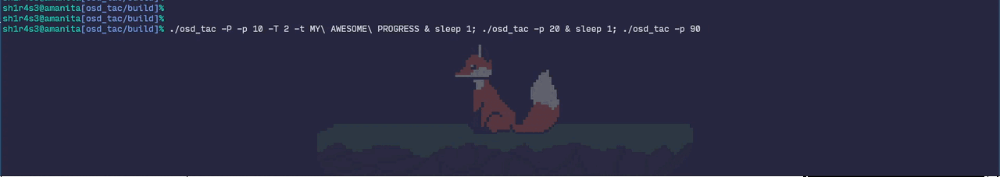

# osd_tac
`osd_tac` is designed to show progress bar on the screen with dynamic update, that is, while the instance of the program is running we can ask it to redraw with a new data through another instance. As of now the communication between instances is built on top of the UNIX sockets.

It has only a few dependencies:
* pthread
* xosd

To build the program simply configure it through `cmake` and build:
```sh
$ cmake -Bbuild .
$ cmake --build build
$ ./build/osd_tac
```

# Example:

